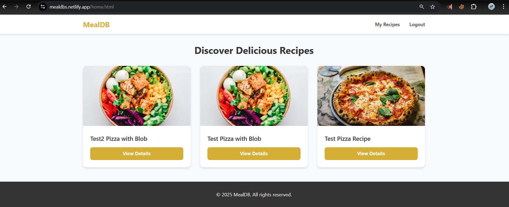
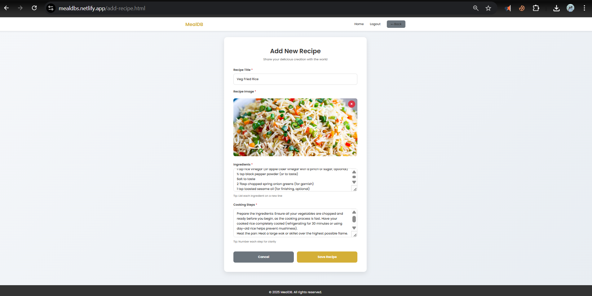
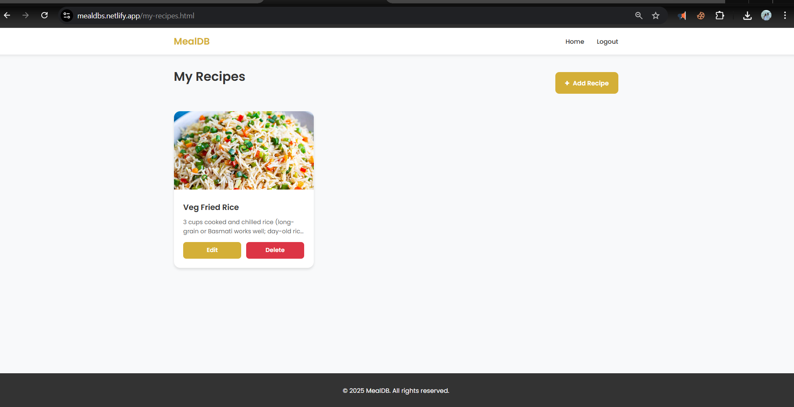

# 🍽️ MealDB

> A full-stack CRUD web application for managing and sharing recipes


**Live Demo:** [https://mealdbs.netlify.app/](https://mealdbs.netlify.app/)

**Status:** 🚧 Work in Progress

---

## 📝 Overview

MealDB is a modern recipe management platform that allows users to create, share, and discover culinary creations. Built with a serverless architecture, the application provides secure user authentication, cloud-based image storage, and a responsive interface for seamless recipe management across devices.

---

## ✨ Features

- 🔐 **User Authentication** - Secure registration and login with JWT-based session management
- ✏️ **Recipe Management** - Full CRUD operations (Create, Read, Update, Delete) for recipes
- 📸 **Image Upload** - Azure Blob Storage integration for recipe photos
- ❤️ **Recipe Likes** - Interactive engagement with community recipes
- 📱 **Responsive Design** - Mobile-friendly interface built with modern HTML, CSS, and JavaScript
- ☁️ **Serverless Backend** - Scalable Netlify Functions powered by Node.js
- 🗃️ **Cloud Database** - Azure SQL Database for reliable data persistence
- 🔒 **Secure Sessions** - Protected routes and authenticated API endpoints

---

## ⚙️ Tech Stack

### Frontend
- HTML5
- CSS3
- Vanilla JavaScript (ES6+)

### Backend
- Node.js
- Netlify Functions (Serverless)
- JWT (JSON Web Tokens)

### Database & Storage
- Azure SQL Database
- Azure Blob Storage

### Deployment
- Netlify (Frontend + Functions)
- Azure Cloud Services

---

## 🧠 Architecture Summary

```
┌─────────────────┐
│   Frontend      │
│  (HTML/CSS/JS)  │
└────────┬────────┘
         │
         ↓
┌─────────────────┐
│ Netlify         │
│ Functions       │
│ (Node.js API)   │
└────┬───────┬────┘
     │       │
     ↓       ↓
┌─────────┐ ┌──────────────┐
│ Azure   │ │ Azure Blob   │
│ SQL DB  │ │ Storage      │
└─────────┘ └──────────────┘
```

- **Frontend**: Static HTML/CSS/JS files served via Netlify CDN
- **Backend**: Serverless functions handle authentication, CRUD operations, and business logic
- **Database**: Azure SQL stores user credentials and recipe metadata
- **Storage**: Azure Blob Storage manages recipe images with secure URLs

---

## 🧰 Setup Instructions

### Prerequisites
- Node.js (v16 or higher)
- Azure account with SQL Database and Blob Storage configured
- Netlify account
- Git

### Local Development

1. **Clone the repository**
   ```bash
   git clone https://github.com/yourusername/mealdb.git
   cd mealdb
   ```

2. **Install dependencies**
   ```bash
   npm install
   ```

3. **Configure environment variables**
   
   Create a `.env` file in the root directory (see [Environment Variables](#-environment-variables) section)

4. **Set up Azure SQL Database**
   - Create tables for users and recipes
   - Update connection string in `.env`

5. **Configure Azure Blob Storage**
   - Create a storage container
   - Add connection string and container name to `.env`

6. **Run locally with Netlify CLI**
   ```bash
   npm install -g netlify-cli
   netlify dev
   ```

7. **Access the application**
   
   Open `http://localhost:8888` in your browser

### Netlify Deployment

1. **Connect repository to Netlify**
   - Log in to Netlify dashboard
   - Click "New site from Git"
   - Select your repository

2. **Configure build settings**
   - Build command: (leave empty for static site)
   - Publish directory: `public`

3. **Add environment variables**
   
   Go to Site Settings → Environment Variables and add all required variables

4. **Deploy**
   
   Push to your main branch or click "Trigger deploy" in Netlify dashboard

---

## 🔑 Environment Variables

Create a `.env` file with the following variables:

```env
# Azure SQL Database
DB_SERVER=your-server.database.windows.net
DB_DATABASE=your-database-name
DB_USER=your-username
DB_PASSWORD=your-password
DB_PORT=1433

# Azure Blob Storage
AZURE_STORAGE_CONNECTION_STRING=your-connection-string
AZURE_STORAGE_CONTAINER_NAME=recipe-images

# JWT Authentication
JWT_SECRET=your-secret-key-here
JWT_EXPIRES_IN=7d

# Application
NODE_ENV=development
```

> ⚠️ **Security Note**: Never commit `.env` files to version control. Ensure `.env` is listed in `.gitignore`.

---

## 📂 Folder Structure

```
MealDB/
├── netlify/
│   └── functions/
│       ├── createRecipe.js      # Create new recipe
│       ├── deleteRecipe.js      # Delete recipe by ID
│       ├── getMyRecipes.js      # Fetch user's recipes
│       ├── getRecipeById.js     # Fetch single recipe
│       ├── getRecipes.js        # Fetch all recipes
│       ├── login.js             # User authentication
│       ├── register.js          # User registration
│       └── updateRecipe.js      # Update recipe by ID
├── public/
│   ├── assets/css/
│   │   └── style.css            # Global styles
│   ├── js/                      # Client-side scripts
│   ├── add-recipe.html          # Recipe creation form
│   ├── edit-recipe.html         # Recipe editing form
│   ├── Home.html                # Main recipe feed
│   ├── index.html               # Landing page
│   ├── login.html               # Login page
│   ├── my-recipes.html          # User's recipe dashboard
│   ├── recipe.html              # Recipe detail view
│   └── register.html            # Registration page
├── .env                         # Environment variables (gitignored)
├── dbConfig.js                  # Database configuration
├── netlify.toml                 # Netlify configuration
├── package.json                 # Dependencies
└── README.md                    # Project documentation
```

---

## 🖼️ Screenshots

### Home Page


### Recipe Detail


### Add Recipe


### My Recipes Dashboard


---

## 🚀 Deployment Info

### Netlify Configuration

The `netlify.toml` file configures serverless functions and routing:

```toml
[build]
  publish = "public"
  functions = "netlify/functions"

[[redirects]]
  from = "/api/*"
  to = "/.netlify/functions/:splat"
  status = 200
```

### Azure Setup Summary

1. **SQL Database**
   - Create an Azure SQL Database instance
   - Configure firewall rules to allow Netlify IP ranges
   - Create required tables (users, recipes, likes)
   - Store connection details in environment variables

2. **Blob Storage**
   - Create a Storage Account
   - Create a container for recipe images
   - Set container access level (Blob or Container)
   - Generate connection string and add to environment

3. **Security Best Practices**
   - Use Azure Key Vault for sensitive credentials (production)
   - Enable SSL/TLS for database connections
   - Implement CORS policies on Blob Storage
   - Rotate JWT secrets regularly

---

## 🙌 Future Enhancements

- 🔍 **Advanced Search** - Filter recipes by ingredients, cuisine, and dietary preferences
- ⭐ **Rating System** - Allow users to rate recipes with star ratings
- 💬 **Comments** - Enable community discussions on recipes
- 👨‍💼 **Admin Panel** - Moderation tools for managing users and content
- 📧 **Email Notifications** - Recipe recommendations and activity updates
- 🌐 **Social Sharing** - Share recipes directly to social media platforms

---

## 🐛 Known Issues

- Image upload progress indicator not implemented
- Recipe like counts may not update in real-time
- Mobile navigation menu requires refinement

---

**Built with ❤️ using modern web technologies**
